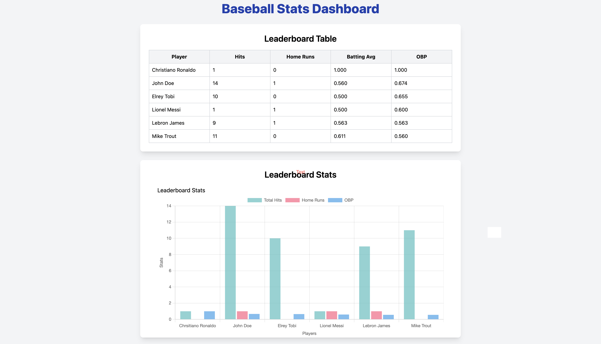
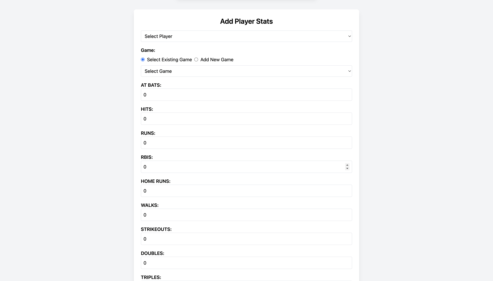
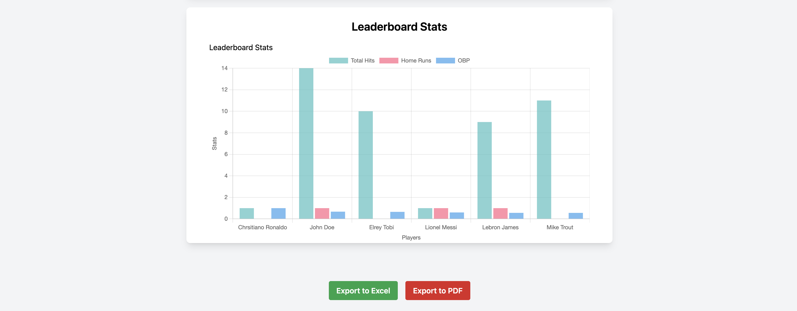

# ⚾ Baseball Stats Dashboard

A full-stack web application built to help college baseball teams collect, manage, and analyze player statistics in real-time. This tool is designed for coaches, players, and data analysts who want actionable insights from game data.

---

## 🚀 Features

- 📊 Dynamic stat trends with visual charts (e.g., Batting Average, Slugging %, OBP, OPS)
- 🏆 Leaderboards with sortable stat columns
- 📝 Admin-only stat entry, editing, and deletion
- 🧑 Player and Game management dashboards
- 📂 CSV upload for bulk stat entry
- 📉 Export data and charts to **PDF** and **Excel**
- 🌙 Dark mode support
- 📱 Mobile-friendly and responsive UI

---

## 🖼️ Screenshots

### 🏠 Dashboard View


### 📝 Stat Entry Form


### 📊 Leaderboard Table

---

## 🛠️ Tech Stack

**Frontend:**
- React
- Tailwind CSS
- Chart.js

**Backend:**
- Node.js
- Express
- PostgreSQL

**Other Tools:**
- `jspdf` + `html2canvas` for PDF export
- `xlsx` + `file-saver` for Excel export

---

## 🔐 Role-Based Access

- **Admin View**: Can add, edit, and delete stats
- **Viewer View**: Can only view data and charts

---

## 📦 Installation

```bash
git clone https://github.com/HarleyPhilippe/baseball-stats-app
cd baseball-stats-app
npm install
npm start
